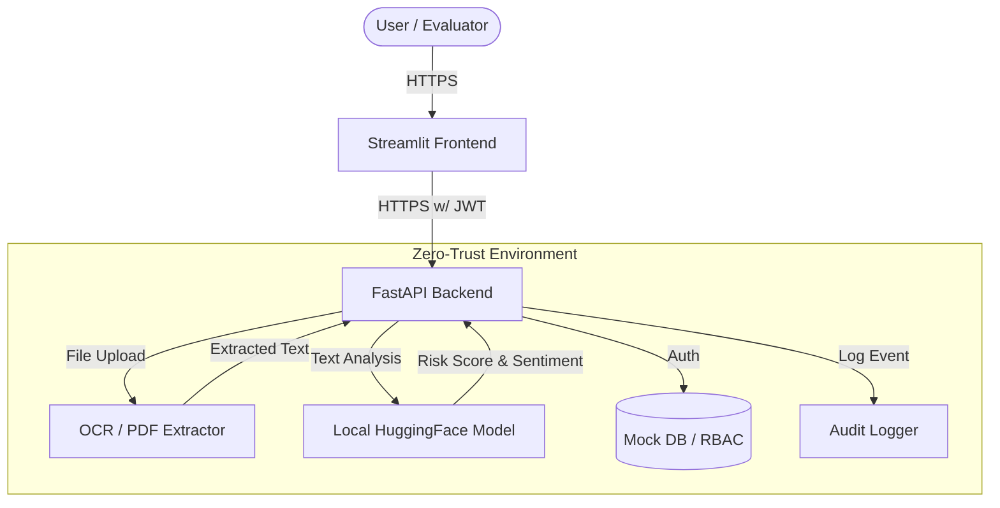

# 🛡️ TenderGuard AI

**Zero-Trust Automated Tender Evaluation System**

Built for the **AI for Bharat Hackathon**, TenderGuard AI is a highly secure, air-gapped prototype designed to automate the evaluation of defense and government tenders. By utilizing a Zero-Trust architecture and local NLP models, it ensures that sensitive procurement data never leaves the local environment while providing rapid, accurate analysis of financial turnover, certifications, and risk metrics.

## 🌟 Key Features

*   **Zero-Trust Architecture:** Operates entirely offline with no external API calls, ensuring zero data leakage.
*   **Automated Evaluation:** Extracts and verifies key criteria such as Financial Turnover, ISO 9001 Certifications, and Past Experience from PDF documents.
*   **AI Risk Assessment:** Utilizes a locally hosted NLP model (`distilbert-base-uncased-finetuned-sst-2-english`) to analyze the document's content and flag potential risks.
*   **Secure Access & Audit Logging:** Implements JWT-based Role-Based Access Control (RBAC) and immutable audit logging for every action taken within the system.
*   **Encrypted Communications:** All internal and external traffic is secured via HTTPS/SSL.

## 🏗️ Architecture Diagram



## 🚀 Getting Started

### Prerequisites

*   **Docker** and **Docker Compose**
*   **Git**

### Installation & Execution

1.  **Clone the Repository:**
    ```bash
    git clone https://github.com/adarshlilhare/TenderGuard-AI.git
    cd TenderGuard-AI
    ```

2.  **Generate SSL Certificates (if not already present):**
    The system requires SSL certificates for secure HTTPS communication. The repository includes a helper script.
    ```bash
    python generate_cert.py
    ```
    *(Note: If you have mkcert installed, you can use it to generate locally trusted certificates instead).*

3.  **Build and Run with Docker Compose:**
    ```bash
    docker-compose up --build -d
    ```

4.  **Access the Application:**
    *   Open your browser and navigate to: `https://localhost:8501`
    *   **Login Credentials:**
        *   **Username:** `admin`
        *   **Password:** `admin123`

## 🚀 Deployment on Railway

The project is structured to be easily deployable on [Railway](https://railway.app/).

### 1. Backend Service
*   **Root Directory:** `/backend`
*   **Environment Variables:** 
    *   `JWT_SECRET`: (Your secret key)
*   **Networking:** Generate a domain or use the internal Railway URL.

### 2. Frontend Service
*   **Root Directory:** `/frontend`
*   **Environment Variables:**
    *   `BACKEND_URL`: The URL of your deployed Backend service.
*   **Networking:** Generate a public domain.

*(Note: Railway terminates SSL automatically, so you don't need to configure SSL environment variables there).*

## 🧠 AI for Bharat Hackathon Context

This project addresses the critical need for secure, localized AI solutions in sensitive sectors like government and defense procurement.

*   **Data Sovereignty:** By keeping all processing local and air-gapped, we eliminate concerns regarding data privacy and external API reliance.
*   **Indigenous Automation:** Replaces slow, manual tender evaluation processes with an automated, AI-driven pipeline capable of verifying specific criteria.
*   **Deployability:** The Dockerized approach ensures it can be deployed on-premise in any secure IT infrastructure quickly and reliably.

## 🛠️ Technology Stack

*   **Frontend:** Streamlit
*   **Backend:** FastAPI, Python
*   **AI/NLP:** HuggingFace Transformers (`DistilBERT`), PyTorch
*   **OCR:** Tesseract, pdf2image
*   **Security:** JWT, SSL/TLS Certificates
*   **Deployment:** Docker, Docker Compose
